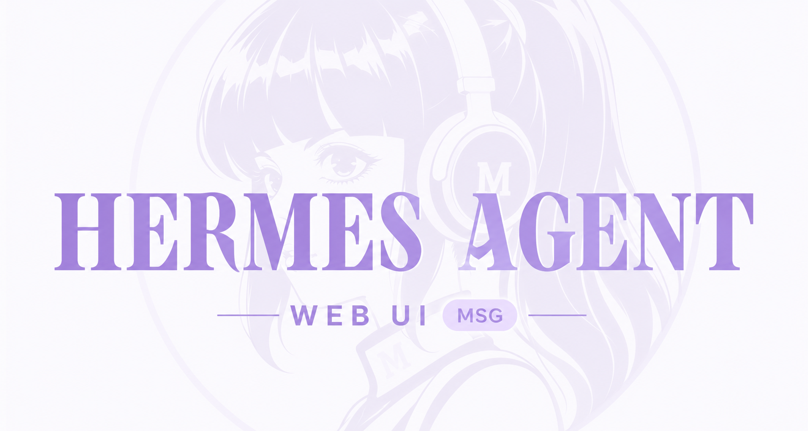
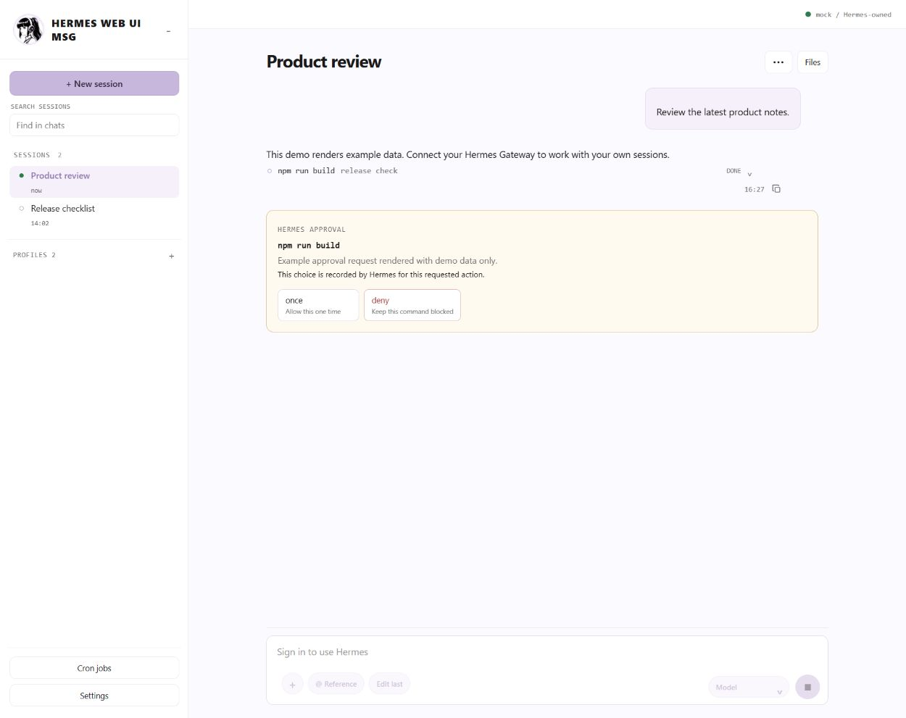
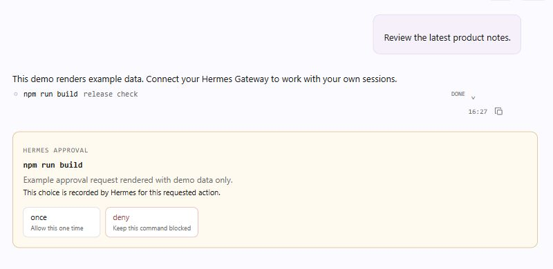
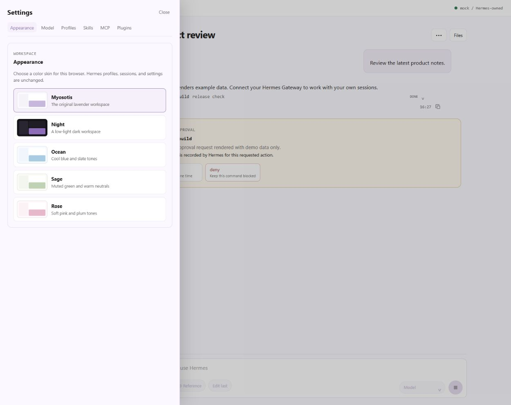

# Hermes Web UI MSG

> **Unofficial community project.** Hermes Web UI MSG is not an official Hermes UI.

A static, self-hostable web interface for a Hermes Dashboard. It keeps the Dashboard as the source of truth for authentication, profiles, sessions, messages, tools, and settings.

[Try the live demo](https://reezex0-ux.github.io/hermes-web-ui-msg/)



> **Demo data only — no Hermes backend connection.**

## Interface

### Workspace and sessions



### Tool execution and approval



### Appearance, skills, and MCP settings



## What it includes

- Chat workspace with session browsing, search, transcript rendering, tool activity, approvals, and message actions.
- Settings for visual skins, model controls, profiles, skills, MCP servers, plugins, and cron jobs when supported by your Dashboard.
- A resizable file panel that stays closed until requested.
- Installable standalone PWA support.
- A GitHub Pages demo mode that uses only generic example data.

## Two safe modes

| Mode | Use case | Gateway access |
| --- | --- | --- |
| Demo | GitHub Pages preview and UI evaluation | Never contacts a Gateway |
| Live | Your own self-hosted Dashboard | Same-origin reverse proxy only |

The repository contains no runtime credentials, browser cookies, session transcripts, server names, or private deployment paths.

## Run it with your Hermes Dashboard

Requirements: Docker Compose and an already-running Hermes Dashboard that you control.

```bash
git clone https://github.com/YOUR_ACCOUNT/hermes-web-ui-msg.git
cd hermes-web-ui-msg
cp .env.example .env
# Edit .env with your own Dashboard values.
docker compose up --build -d
```

Open `http://localhost:8080`. Put the container behind your own HTTPS proxy before exposing it beyond your machine or private network.

### Configuration

| Variable | Meaning |
| --- | --- |
| `HERMES_UPSTREAM` | Dashboard URL reachable from the container. |
| `HERMES_BACKEND_HOST` | Exact Host header accepted by that Dashboard. |
| `HERMES_BACKEND_ORIGIN` | Matching origin used only for the Gateway WebSocket handshake. |
| `NEXT_PUBLIC_HERMES_MODE` | `live` for a real connection; `demo` for example data only. |
| `NEXT_PUBLIC_BASE_PATH` | Optional subpath, such as `/workspace`. |

For OAuth-protected Dashboards, register the public HTTPS origin you deploy and use that same origin when starting the Dashboard.

## Security boundary

Hermes remains the authentication authority. The browser reaches the Dashboard through same-origin `/api`, `/auth`, and WebSocket routes; no Dashboard token, cookie, API key, or private endpoint belongs in frontend source or in Git.

## Development

```bash
npm ci
npm run build
```

For a local demo build:

```bash
NEXT_PUBLIC_HERMES_MODE=demo npm run build
```

For a GitHub Pages project site, also set `NEXT_PUBLIC_BASE_PATH` to the repository path.

## Give this to an agent

> Clone this repository, copy `.env.example` to `.env`, configure it for the Hermes Dashboard I control, run `docker compose up --build -d`, and verify that `http://localhost:8080` loads. Do not commit `.env` or place Dashboard credentials in browser code.

## License

Released under the [MIT License](LICENSE).
